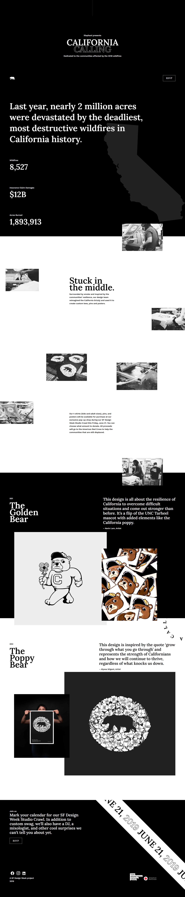

# Bootcamp Exercise - Californa Calling

## Table of contents

- [Overview](#overview)
  - [The challenge](#the-challenge)
  - [Screenshot](#screenshot)
  - [Links](#links)
- [My process](#my-process)
  - [Built with](#built-with)
  - [What I learned](#what-i-learned)

## Overview

### The challenge

Users should be able to:

- Redesign a Figma Prototype
- Build two animations with keyframes

### Screenshot

### Links

- Solution URL: [https://borisd2023.github.io/Project-California-Calling/]

## My process

### Built with

- Semantic HTML5 markup
- SASS/SCSS
- Grid
- Flexbox
- Animations CSS, Keyframes

### What I learned

How to build a complete Landingpage with SCSS.
